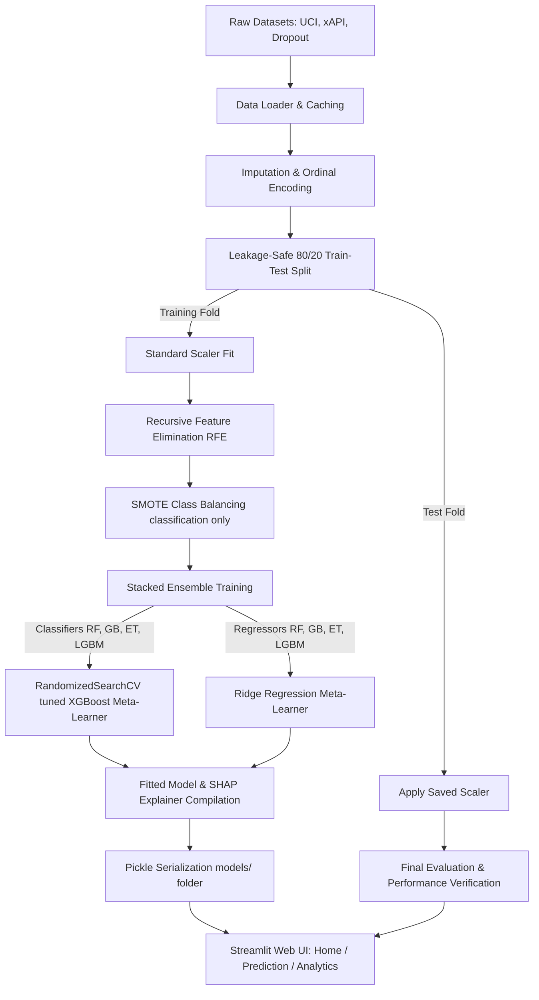

# EduPredict: Student Performance Analytics Platform

EduPredict is an explainable machine learning platform designed to predict and analyze student performance. It utilizes a **Stacked Generalization Ensemble** where **hyperparameter-tuned XGBoost** serves as the classification meta-learner and **Ridge Regression** serves as the regression meta-learner. The system is enhanced with **SHAP (SHapley Additive exPlanations)** to provide transparent, local, and global decision explanations for academic advisers and educators.

This repository represents the official practical implementation for the B.Tech Final Year Project in Computer Science at **Bells University of Technology**.

---

## 🎓 Project & Academic Metadata

| Field | Details |
| :--- | :--- |
| **Project Topic** | Design and Implementation of a Student Performance Prediction System Using XGBoost Enhanced with SHAP Features |
| **Author** | Amromawhe Osemudiamen Erumuakpor |
| **Matric No.** | 2021/10248 |
| **Degree** | B.Tech Computer Science |
| **Department** | Computer Science |
| **Institution** | Bells University of Technology, Ota, Ogun State, Nigeria |
| **Supervisor** | Dr. O.J. Olaleye |
| **Date** | December 2025 |

---

## 🚀 Key Features

1. **Interactive Prediction Engine**:
   - Allows users (lecturers/advisers) to build student profiles dynamically using input sliders and drop-down menus.
   - Outputs real-time performance predictions (grade band or categorical class) with prediction confidence scores.
   - Renders interactive **SHAP Force Plots** and contribution tables showing which features pushed the prediction higher or lower.
2. **Model Analytics Dashboard**:
   - Compares metrics (Accuracy, Precision, Recall, Macro F1, MSE, RMSE, $R^2$) across three benchmark datasets.
   - Shows confusion matrices and One-vs-Rest ROC curves.
   - Plots global feature drivers using mean absolute SHAP values.
3. **Robust ML Pipeline**:
   - Auto-fetches and extracts benchmark datasets.
   - Strictly controls data leakage by performing preprocessing splits before scaling, recursive feature selection (RFE), and SMOTE class balancing.

---

## 🏗️ System Architecture & Data Pipeline

The pipeline is split into a **Data Layer**, a **Machine Learning Layer**, and a **Presentation Layer**:



---

## 📂 Project Repository Structure

- `app.py`: The landing page of the application outlining B.Tech project details, ML pipeline steps, and datasets.
- `pages/1_Prediction_Engine.py`: The interactive prediction engine displaying confidence metrics and SHAP force plots.
- `pages/2_Model_Analytics.py`: The evaluation dashboard parsing classification reports, confusion matrices, ROC curves, and global SHAP summary bar charts.
- `src/data_loader.py`: Handles downloading, caching, unpacking, and formatting benchmark datasets with mock fallbacks.
- `src/train.py`: Orchestrates the machine learning pipeline, including feature selection, stacking ensemble training, hyperparameter search, metrics logging, and artifact generation.
- `data/`: Destination directory for downloaded CSV datasets.
- `models/`: Destination directory for serialized model pickles (`.pkl`) and visual evaluation assets (`.png`).
- `docs/`: Holds academic files, including `THESIS_CHAPTERS_1_TO_5.md`.
- `requirements.txt`: Defines Python library dependencies.

---

## 💻 Installation & Setup Guide

Follow these instructions to run the project locally on your system.

### Prerequisites
- **Python**: Version `3.8` to `3.11` (Note: Ensure Python is added to your environment `PATH`).
- **Git** (optional): For version control.

### Step 1: Clone or Navigate to the Workspace
Clone the repository or open the project folder in your terminal:
```bash
cd student-performance-xgboost-shap
```

### Step 2: Create and Activate a Virtual Environment
It is highly recommended to isolate dependencies inside a virtual environment:

- **Windows (Command Prompt):**
  ```cmd
  python -m venv venv
  venv\Scripts\activate
  ```
- **Windows (PowerShell):**
  ```powershell
  python -m venv venv
  .\venv\Scripts\activate
  ```
- **macOS/Linux:**
  ```bash
  python3 -m venv venv
  source venv/bin/activate
  ```

### Step 3: Install Dependencies
Install all required libraries specified in the requirements file:
```bash
pip install -r requirements.txt
```

### Step 4: Run the Machine Learning Training Pipeline
Before running the dashboard, you must train the models to generate the classifier/regressor pickles and SHAP explainers:
```bash
python src/train.py
```
*What this script does:*
1. Downloads the UCI Student Performance, xAPI, and UCI Dropout datasets if they are missing from `data/`.
2. Imputes missing values, encodes categories, and standardizes variables.
3. Performs RFE to select optimal features.
4. Applies SMOTE to resolve class imbalances.
5. Fuses base trees into the meta-learner ensembles (using randomized search to tune the `XGBClassifier`).
6. Saves serialized pickle assets (`_model.pkl`, `_explainer.pkl`, `_pipeline.pkl`) and confusion/ROC png figures to `models/`.

### Step 5: Start the Streamlit Application
Launch the web interface locally:
```bash
streamlit run app.py
```
This opens the browser automatically to the local address (typically `http://localhost:8501`). Use the sidebar to toggle between:
- **Home Page**: System details and project information.
- **Prediction Engine**: Real-time student profile simulation and SHAP explanations.
- **Model Analytics**: Accuracy benchmarks and global feature drivers.

---

## 📊 Datasets Profile

The platform evaluates models across three distinct educational datasets:

1. **UCI Student Performance (Mathematics)**
   - **Sample size**: 395 students
   - **Target**: Regression to predict final grade $G3$ ($0$ to $20$).
   - **Features**: Demographics, parental education, study time, class failures, absences, and mid-term grades ($G1$, $G2$).
2. **xAPI-Edu-Data (K-12 Online Learning)**
   - **Sample size**: 480 students
   - **Target**: Multi-class classification into performance bands: Low (0), Medium (1), or High (2).
   - **Features**: Digital engagement traces (raised hands, resource views, discussion participation, survey feedback, absence flags).
3. **UCI Predict Students' Dropout and Academic Success (UCI #697)**
   - **Sample size**: 4,424 students
   - **Target**: Multi-class classification: Dropout (0), Enrolled (1), or Graduate (2).
   - **Features**: Academic records at enrollment, curricular units approved/evaluated in semesters 1 & 2, demographics, and macroeconomic rates.

---

## 🔬 Experimental Evaluation Results

Here is a summary of the baseline performance metrics achieved on the hold-out test sets:

| Dataset | Task Type | 5-Fold CV Score | Test Metric | Key Insights |
| :--- | :--- | :--- | :--- | :--- |
| **UCI Student** | Regression | $R^2 = 0.8784 \pm 0.0367$ | $R^2 = 0.8265$ (RMSE: $1.8863$) | Explains ~83% of final grade variance. Typical prediction error is less than one grade step. |
| **xAPI-Edu** | 3-Class Clf | Accuracy: $77.13\% \pm 2.78\%$ | Accuracy: $75.00\%$ (Macro F1: $0.7600$) | Strongest precision/recall achieved on Low-performing category (85% F1), minimizing false negatives for at-risk cases. |
| **UCI Dropout** | 3-Class Clf | *(Run-dependent)* | *(Run-dependent)* | Integrates curricular progression stats from both semesters to predict retention/graduation. |

---

## 🛠️ Troubleshooting & Support

- **"Model artifacts not found" error**:
  Ensure you run `python src/train.py` from the root folder first. This writes the essential pickles into `models/`.
- **Package compilation failure on Windows**:
  If building packages like `lightgbm` or `xgboost` throws C++ compiler exceptions, make sure you have the *Build Tools for Visual Studio* installed or run your terminal inside an Anaconda environment.
- **Slow SHAP Force Plot loading**:
  Computing SHAP Kernel explanations is computationally intensive. The pipeline implements a $K$-means background summary (size 50) to optimize inference down to 2–5 seconds per run.
